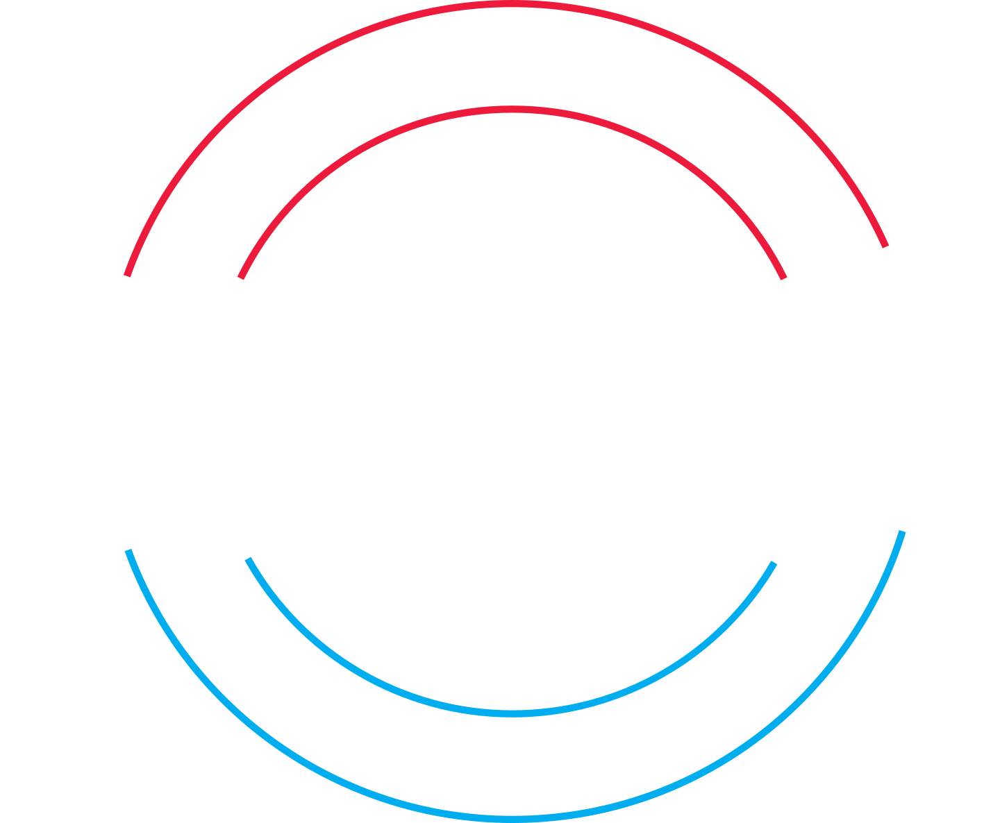

# OpenFIRE - The Open *Four Infa-Red Emitter* Light Gun System
###### Successor to [GUN4ALL](http://github.com/SeongGino/ir-light-gun-plus), which is based on the [Prow Enhanced fork](https://github.com/Prow7/ir-light-gun), which in itself is based on the 4IR Beta "Big Code Update" [SAMCO project](https://github.com/samuelballantyne/IR-Light-Gun)

## Features:
- **Fully featured peripherals:** Solenoid & Rumble Force Feedback, TMP36 Temperature Monitoring, and others to come.
- **Multiple IR layouts support**, with *realtime perspective-adjusted tracking* for both double lightbar (recommended!) and Xwiigun-like diamond layouts (compatible with other systems).
- **Flexible Input System** with outputs to Keyboard, 5-button ABS Mouse, and dual-stick gamepad w/ d-pad support.
- **Easy installation:** Simple *.UF2* binaries that can be drag'n'dropped directly onto an *RP2040*-based Microcontroller.
- **Portable on-board settings** (using an emulated EEPROM) to store calibration profiles, toggles, settings, mappings (WIP), identifier and more to come.
- **Integrates with the [OpenFIRE App](https://github.com/TeamOpenFIRE/OpenFIRE-App)** for user-friendly, and cross-platform configuration.
- **Optimized for the RP2040**, using a second core for input reading and serial handling, and the main core for camera and peripherals processing, whenever possible.
- **Compatible with PC Force Feedback handlers** such as [Mame Hooker](https://dragonking.arcadecontrols.com/static.php?page=aboutmamehooker) and [QMamehook](https://github.com/SeongGino/QMamehook).
- **Supports integrated OLED display output** for *SSD1306 I2C displays* for menu navigation and visual feedback of game elements such as life and current ammo counts.
- **Forever free and open source to the lightgun community!**

## Requirements
- An **RP2040** microcontroller for running the OpenFIRE firmware.
  * Recommended boards for new builds would be the [Raspberry Pi Pico](https://www.raspberrypi.com/products/raspberry-pi-pico/) *(cheapest, most pins available),* Adafruit [Kee Boar KB2040](https://www.adafruit.com/product/5302) *(cheaper, Pro Micro formfactor, compatible with other carrier boards),* or [ItsyBitsy RP2040](https://www.adafruit.com/product/4888) *(compatible with [SAMCO carrier boards](https://www.ebay.com/itm/184699412596))*
- **DFRobot IR Positioning Camera [SEN0158]:** [Mouser (US Distributor)](https://www.mouser.com/ProductDetail/DFRobot/SEN0158?qs=lqAf%2FiVYw9hCccCG%2BpzjbQ%3D%3D) | [DF-Robot (International)](https://www.dfrobot.com/product-1088.html) | [Mirrors list](https://octopart.com/sen0158-dfrobot-81833633)
- **4 IR LED emitters:** regular Wii sensor bars might work for small distances, but it's HIGHLY recommended to use [SFH 4547 LEDs](https://www.mouser.com/ProductDetail/720-SFH4547) w/ 5.6Ω *(ohm)* resistors. [DIY build tutorial here!](https://www.youtube.com/watch?v=dNoWT8CaGRc)
   * Optional: **Any 12/24V solenoid,** w/ associated driver board. [DIY build tutorial here!](https://www.youtube.com/watch?v=4uWgqc8g1PM) [Easy driver board here](https://oshpark.com/shared_projects/bjY4d7Vo)
     * *Requires a DC power extension cable &/or DC pigtail, and a separate adjustable 12-24V power supply.*
   * Optional: **Any 5V gamepad rumble motor,** w/ associated driver board. [DIY build tutorial here!](https://www.youtube.com/watch?v=LiJ5rE-MeHw) [Easy driver board here](https://oshpark.com/shared_projects/VdsmUaSm)
   * Optional: **Any 2-way SPDT switches,** to adjust state of rumble/solenoid/rapid fire in hardware *(can be adjusted in software if not available!)*
   * Optional: **Any WS2812B GRB NeoPixels,** or any four-pin RGB LED for realtime lighting and reactions. [Amazon](https://www.amazon.com/BTF-LIGHTING-WS2812B-Heatsink-10mm3mm-WS2811/dp/B01DC0J0WS) | [AliExpress (International)](https://www.aliexpress.us/item/3256801340809756.html)
   * Optional: **SSD1306-based I2C (2wire/4pin) 128x64 OLED display** for visual UI and life/ammo counter feedback support. [AliExpress (International)](https://www.aliexpress.us/item/3256806186748120.html)
 
## Installation:
Grab the latest *.UF2* binary for your respective board [from the releases page](https://github.com/TeamOpenFIRE/OpenFIRE-Firmware/releases/latest), and drag'n'drop the file to your microcontroller while booted into Bootloader mode; the RP2040 is automatically mounted like this when no program is loaded, but it can be forced into this mode by holding BOOTSEL while plugging it into the computer - it will appear as a removable storage device called **RPI-RP2**.

## Additional information
[Check out the enclosed instruction book!](SamcoEnhanced/README.md) For developers, consult the README files in `libraries` for more information on library functionality.

## Known Issues:
- *None... so far*

> [!NOTE]
> Solenoid *may* cause EMI disconnects with too thin of wiring. Cables for this run specifically should be **22AWG** at its thinnest - or else the cables will become antennas under extended use, which will trip USB safety thresholds in your PC to protect the ports.

## TODO:
- (Re-)expose button function remapping.
- Should implement support for rumble as an alternative force-feedback system (currently under `RUMBLE_FF` define, but should be a normal toggleable option).
- Display currently uses Adafruit_GFX/SSD1306 library, but should we maybe consider [OneBitDisplay](https://github.com/bitbank2/OneBitDisplay) instead? It seems compatible with Adafruit lib's syntax, so should be a drop-in replacement if need be.
- Use more appropriate RP2040-specific subsystems? See [TimerInterrupt](https://github.com/git2212/RPI_PICO_TimerInterrupt) for hw timers library, not sure if NeoPixels has such an option for our use case.
- Start librarifying more sections of the code for better readability/portability, i.e. pause mode and serial processing/handling in bespoke classes.

## Thanks:
* Samuel Ballantyne, for his original SAMCO project, the gorgeous OpenFIRE branding, and perspective-based tracking system.
* Prow7, for his enhanced SAMCO fork which provided the basis of pause mode and saving subsystems.
* Odwalla-J, mykylegp, RG2020 & lemmingDev for prerelease consultation, bug testing and feedback.
* The IR-GUN4ALL testers for their early feedback and feature requests - this wouldn't have happened without you lot!
* Orhan Yiğit Durmaz for TinyUSB HID gamepad descriptors examples, and Chris Young for his TinyUSB compatible library (now part of `TinyUSB_Devices`).
